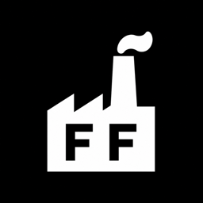

<p align="center"></p>

# 流程工廠｜Factory Flow Workspace

G大的內容生產控制台。純前端 HTML + Python 後端，以通用工作流 JSON 管理所有工廠與製作步驟。

新安装默认只包含一个「URL轉短影片工廠」。其他工厂由获得授权的用户按需自行创建；升级安装不会覆盖用户数据目录中已有的 `workflows.json`。

<h1 align="center">🚀 Flow Factory 安裝</h1>

<p align="center"><strong>正式版本可使用安裝腳本；開發者也可以直接從私有倉庫啟動。</strong></p>

## 正式版本一鍵安裝（macOS / Linux）

正式安装包由 Cloudflare Pages 免费静态托管提供。客户不需要 GitHub 帐号、仓库权限或 GitHub Token：

```bash
curl -fsSL https://flowfactory-updates.pages.dev/install.sh | sh
```

安装完成后脚本会自动启动本地服务、尝试打开默认浏览器，并在终端明确显示操作面板地址 `http://127.0.0.1:8765/`。如果系统阻止自动打开，复制该地址到浏览器即可。

如果某台电脑的 Python 缺少 CA 根证书，页面更新仍会使用系统 `curl` 完成 HTTPS 证书验证与下载，并继续执行 SHA-256 校验；不会通过关闭 SSL 验证绕过安全检查。

安裝完成後可執行：

```bash
~/.local/bin/flowfactory start
~/.local/bin/flowfactory stop
~/.local/bin/flowfactory update
~/.local/bin/flowfactory uninstall
~/.local/bin/flowfactory version
```

macOS 安裝或更新時，若桌面目錄可寫入，會自動建立帶有 Flow Factory Logo 的 `~/Desktop/Flow Factory.app` 快捷方式。它會檢查正式版服務後使用預設瀏覽器開啟 `http://127.0.0.1:8765/`；快捷方式不是原生 App，不會編譯或要求安裝 Xcode。

`flowfactory uninstall` 只移除程序并保留 `~/.flowfactory/data`。确认连设置、工作流与 Token 一并删除时，使用 `flowfactory uninstall --purge`，并按提示输入 `DELETE`。

通过安装脚本安装后，可以在「工作台设置 → 版本更新」直接检查和安装新版，也可以执行 `flowfactory update`。两种方式都从 Cloudflare 下载，验证 SHA-256、保留用户数据、切换版本并自动重启。开发目录直接运行的版本不会允许页面覆盖安装。

macOS 正式安装版可在「工作台设置 → 系统启动」开启“登录后自动启动”。系统会建立 `~/Library/LaunchAgents/com.gda.flowfactory.plist`，登录后在后台启动服务且不自动打开浏览器。关闭开关或卸载 Flow Factory 时会移除此配置。

程式版本存放於 `~/.flowfactory/versions`，使用者設定與工作流存放於 `~/.flowfactory/data`，更新時不會覆蓋使用者資料。

## 授權系統

Flow Factory 提供免費版、月費版與終身版。免費版只顯示並允許使用 `workflows.json` 的第一個工廠；限制同時在前端與 Python API 執行，直接修改 JSON 或呼叫 API 都不能啟用第二個工廠。點擊「＋新增工廠」會開啟授權與升級頁。

- 免費版：完整使用第一個工作流工廠。
- 月費版：授權碼生成後不會開始倒數，客戶第一次成功啟用時才依有效月數計算到期日；解鎖全部工廠，每次成功連線驗證後可離線使用 7 天，但不會超過訂閱到期日。
- 終身版：解鎖全部工廠，已簽章的本機授權可永久離線驗證。

客戶可點頁面頂部「🔑 授權」查看方案、到期日與輸入授權碼。授權資料保存在 `~/.flowfactory/data/license.json`，權限為当前使用者可讀；移除授權不會刪除工作流，只會重新隱藏付費工廠。

### Cloudflare 授權服務

授權 API 部署於 `https://flowfactory-license.gavinlo3692.workers.dev`，使用 Worker `flowfactory-license` 與 D1 資料庫 `flowfactory-license`。D1 只保存授權碼的 SHA-256 雜湊，不保存明文授權碼；Worker 使用 P-256 私鑰簽章，本機安裝包只包含公鑰，因此無法自行偽造有效授權。

私密設定：

| Cloudflare Secret | 用途 |
|---|---|
| `ADMIN_TOKEN` | 僅維護者建立授權碼時使用 |
| `SIGNING_PRIVATE_JWK` | 簽發本機可驗證的 P-256 授權資料 |

兩個 Secret 均不可提交 GitHub、寫入 README 或提供給客戶。Cloudflare 官方建議使用 Worker Secrets 保存敏感值，D1 則以 `DB` binding 提供給 Worker。

建立月費或終身授權碼：

```bash
export FLOWFACTORY_LICENSE_ADMIN_TOKEN='只存在維護者密碼管理器中的管理 Token'
python3 scripts/create_license.py monthly --months 1 --max-devices 3
python3 scripts/create_license.py lifetime --max-devices 3
python3 scripts/create_license.py monthly --count 10 --months 1 --max-devices 1
```

macOS 管理者可直接雙擊 `scripts/create-license.command` 開啟只監聽 `127.0.0.1` 的授權管理后台。第一次輸入 `ADMIN_TOKEN` 後，密鑰會保存於目前使用者的 macOS 鑰匙圈，浏览器端不會取得管理密鑰。后台可查看最多 500 筆授權、未啟用／已啟用狀態、首次啟用日、到期日，批量建立 1–100 個月費或終身授權碼、調整方案/有效月數/到期日/裝置數、啟用或停用，以及重置裝置綁定。新月費碼在首次啟用前不會開始倒數；完整授權碼只會在建立時顯示一次，舊記錄因 D1 僅保存 SHA-256 雜湊，無法反查明文。

完整操作、安全说明与文件结构请参阅 [`docs/license-admin.md`](docs/license-admin.md)。

授權碼只會在建立時回傳一次，應透過安全管道交付客戶。一般管理操作使用本機授權后台；数据库底层记录仍可在 Cloudflare D1 管理介面检查。

授權服務部署與資料庫 migration：

```bash
cd cloudflare/license-worker
npx wrangler d1 migrations apply flowfactory-license --remote
npx wrangler deploy
```

Worker 設定檔、migration 與程式碼可提交 GitHub；`.dev.vars`、`.env`、管理 Token 與簽章私鑰禁止提交。

## Cloudflare Pages 升级架构

客户侧完全不接触 GitHub。GitHub 只用于私有源码、测试和触发发布：

```text
私有 GitHub 仓库
    ↓ 推送 vX.Y.Z 标签
GitHub Actions 测试与打包
    ↓ 使用仓库 Secrets 上传
Cloudflare Pages（flowfactory-updates.pages.dev）
    ├── install.sh
    ├── latest.json
    └── releases/X.Y.Z/
        ├── manifest.json
        ├── flowfactory-X.Y.Z.tar.gz
        └── flowfactory-X.Y.Z.tar.gz.sha256
            ↓
客户页面更新 / flowfactory update
```

### 匿名安装与更新统计

安装脚本与应用内更新成功后，会向授权服务发送一笔匿名事件，并保存到现有 Cloudflare D1：

- `installations`：匿名设备的首次安装时间、最后出现时间、系统、架构和当前版本。
- `installation_events`：每次成功安装或更新的事件记录。

设备在本机 `$HOME/.flowfactory/data/install_id` 保存随机编号，云端只保存它的 SHA-256 摘要。统计不会上传客户姓名、授权码、本地文件路径或设备原始编号。打开桌面的「FlowFactory 授权管理后台」，即可在「安装与更新统计」查看累计设备、今日／本月新增、版本分布、系统分布和最近事件。

用户如需关闭匿名统计，可在安装或更新前设置：

```bash
export FLOWFACTORY_DISABLE_TELEMETRY=1
```

`latest.json` 是客户端唯一的版本入口，格式如下：

```json
{
  "schema_version": 1,
  "version": "1.5.0",
  "published_at": "2026-07-18T00:00:00+00:00",
  "release_notes": "Flow Factory 1.5.0",
  "archive": {
    "url": "releases/1.5.0/flowfactory-1.5.0.tar.gz",
    "sha256": "64位SHA-256",
    "size": 123456
  }
}
```

每次发布都是一个独立、不可变的 Pages Deployment。整个目录部署成功后才会切换生产版本，因此客户端不会看到只上传了一半的新版本。

### Cloudflare 首次配置

1. 在 Cloudflare Pages 建立 Direct Upload 项目 `flowfactory-updates`。
2. 项目默认公共地址为 `https://flowfactory-updates.pages.dev`，不需要 R2 或信用卡。
3. 创建仅具有 `Account → Cloudflare Pages → Edit` 权限的 API Token，不要授予其他账号权限。
4. 在私有 GitHub 仓库 Settings → Secrets and variables → Actions 配置：

| 类型 | 名称 | 内容 |
|---|---|---|
| Secret | `CLOUDFLARE_ACCOUNT_ID` | Cloudflare Account ID |
| Secret | `CLOUDFLARE_PAGES_API_TOKEN` | 只有 Cloudflare Pages Edit 权限的 API Token |

这些凭证只存在 GitHub Actions。不得写入源码、安装包、`latest.json` 或客户电脑。

### 日常发布流程（以后继续开发必须遵守）

1. 修改代码并补充测试。
2. 根据语意化版本选择 Patch、Minor 或 Major 版本。
3. 执行：

   ```bash
   python3 scripts/release.py <新版本> "中文摘要" "中文细节"
   python3 -m unittest discover -s tests -v
   git diff --check
   ```

4. 使用中文提交：`v<版本>：<中文摘要>`。
5. 创建同版本附注标签并推送主分支与标签。
6. GitHub Actions 自动测试、打包、计算 SHA-256，并把完整目录部署到 Cloudflare Pages。
7. Pages Deployment 成功切换到生产环境后，页面与 `flowfactory update` 才会发现新版。
8. 发布后必须验证：

   ```bash
   curl -fsSL https://flowfactory-updates.pages.dev/latest.json
   curl -fsSL https://flowfactory-updates.pages.dev/install.sh | sh
   flowfactory version
   ```

9. 确认页面“检查更新”、下载安装、自动重启、原有工作流与设置保留。

### 客户升级流程

页面升级：

```text
设置 → 版本更新 → 检查更新 → 下载并安装更新
```

终端备用升级：

```bash
flowfactory update
```

客户端读取 `latest.json`，下载对应版本压缩包，计算本地 SHA-256，与清单比对成功后才解压。新版本安装在独立版本目录，成功后切换 `~/.flowfactory/current` 并重启；`~/.flowfactory/data` 不会被覆盖。

### 回滚流程

Cloudflare Pages 会保留历史 Deployment。需要回滚时，在 Pages 项目的 Deployments 页面选择上一个已验证版本并执行 Rollback；也可以重新部署旧版构建目录。已安装新版本的用户若需要强制降级，应由维护者提供明确版本的安装命令或人工切换 `~/.flowfactory/current`，不要让普通更新逻辑自动降级。

### v1.4.0 以前版本的迁移

旧版更新器仍然读取 GitHub，无法自动知道新的 Cloudflare 地址。迁移时让客户执行一次新的 Cloudflare 安装命令：

```bash
curl -fsSL https://flowfactory-updates.pages.dev/install.sh | sh
```

安装器会复用 `~/.flowfactory/data`，不会覆盖既有工作流、设置或 Agent 配置。完成这一次迁移后，未来更新全部走 Cloudflare。

## 開發版：請使用 Agent 幫你安裝

### 第一步：下載專案

在 GitHub 點擊右上角：

```text
Code → Download ZIP
```

解壓 ZIP，記住專案資料夾的位置（可改名為 `factory-flow`）。熟悉 Git 的使用者也可以執行：

```bash
git clone https://github.com/gda-ai-agent/factory-flow.git
```

### 第二步：把以下提示詞複製給 Agent

先把專案資料夾拖進 Agent 對話，或將第一行的路徑換成你的實際資料夾位置，再完整複製以下內容：

```text
請幫我安裝並啟動 Flow Factory。

專案資料夾：請使用我附加的 Flow Factory 專案資料夾；如果沒有附加資料夾，請先詢問我完整路徑。

請依序完成：
1. 確認目前作業系統與 Python 3 是否可用。
2. 檢查專案內是否包含其他使用者的 /Users/... 絕對路徑，將啟動器與預設輸出位置改成我目前電腦的路徑。
3. 將預設內容輸出位置設為 ~/Desktop/FlowFactory；建立前先確認目標範圍，不要刪除既有檔案。
4. 確保 factory_flow_start.command 與 stop.command 可以執行。
5. 啟動本機服務，但不要安裝或啟用我沒有授權的外部服務。
6. 確認 http://127.0.0.1:8765/ 能正常開啟，並檢查頁面沒有 JavaScript 錯誤。
7. 不要把 Agent Token、Webhook Token、密碼或其他私密資料提交到 GitHub。
8. 完成後告訴我：如何啟動、如何停止、設定檔位置，以及內容輸出位置。
```

### 第三步：開始使用

Agent 完成安裝後，雙擊：

```text
factory_flow_start.command
```

瀏覽器會打開 <http://127.0.0.1:8765/>。如需直接執行任務，可在「⚙ 工作台設定 → Agent 連接」中連接 Webhook；沒有 Webhook 也可以使用「複製任務給 Agent」。

> 目前的雙擊啟動器以 macOS 為主。Windows 或 Linux 使用者請讓 Agent 依作業系統建立對應啟動方式。

## 版本管理

目前版本記錄於 [`VERSION`](VERSION)，完整中文更新內容請查看 [`CHANGELOG.md`](CHANGELOG.md)。

### 工廠定時執行

在工廠流程列表頂部點擊時鐘按鈕，可為目前工廠設定自動執行：

- 每隔 1～24 小時執行
- 每天固定時間執行
- 指定日期與時間執行一次

排程由本機 Flow Factory 服務執行，不需要一直開著瀏覽器頁面。設定會寫入使用者資料目錄的 `schedules.json`；重新啟動電腦後，需確保 Flow Factory 已啟動，建議同時開啟「登入後自動啟動」。

### 流程參數與 JSON 備份

- 新增或修改流程卡片時，可為輸入參數設定選填的默認值。使用者沒有另外輸入時，手動執行與定時執行會採用該值。
- 在「工作台設定 → JSON 設定」可下載目前的 `workflows.json`。
- 可將 `.json` 文件直接拖入 JSON 編輯器。文件只會先載入預覽，必須點擊「儲存修改」才會寫入本機設定。

發布新版本時執行：

```bash
python3 scripts/release.py 1.0.1 "修正提示詞顯示" "提示詞預設收合" "保留複製與執行功能"
```

版本採語意化規則：小修正升 Patch、新功能升 Minor、不相容改版升 Major。每個 GitHub 版本都會包含中文提交訊息及同版本的 `vX.Y.Z` Git 標籤。

## 檔案結構

```
automoney_realtime_panel/
  index.html          # 單頁工作台（純前端）
  server.py           # 本地 HTTP 伺服器（:8765）
  factory_flow_start.command  # 雙擊啟動
  workflows.json      # 工廠與流程設定
  app_settings.json   # 開發模式的共用內容儲存路徑
```

## 啟動

雙擊 `factory_flow_start.command`，或終端執行：

```bash
cd ~/Desktop/automoney_realtime_panel
python3 server.py
```

瀏覽器開啟 <http://127.0.0.1:8765/>。

## 工作台設定

右上角「設定」可修改所有工廠共用的內容儲存根目錄，並直接檢視或維護 `workflows.json`。所有工廠均使用同一套通用資料結構。

## 工作流（7 步）

1. **今日選題** — AI 雷達找出唯一母題
2. **投研母稿** — 生成所有內容的唯一來源
3. **Threads** — 母稿拆成多篇短內容
4. **YouTube** — 母稿轉成自然口播稿
5. **Patreon** — 整理會員完整版交付
6. **留言回收** — 把互動變成明日選題
7. **明日規劃** — 復盤並決定下一題
